# Ecommerce Django Store

### This project is an online ecommerce store that allows you to purchase items on the store whether you have an account or not through means of PayPal or card payments.

### The site also has many other features where you can change your login details, track your orders and update your basket as you go through your shopping experience.

# Home Page
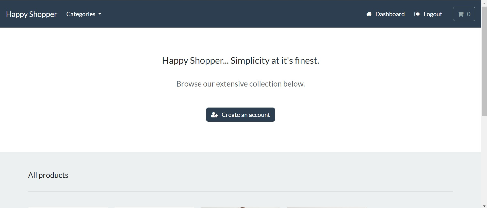

# Products
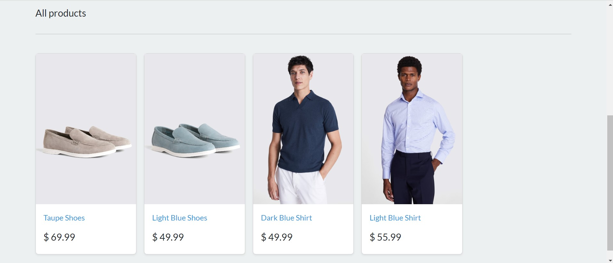

# Login
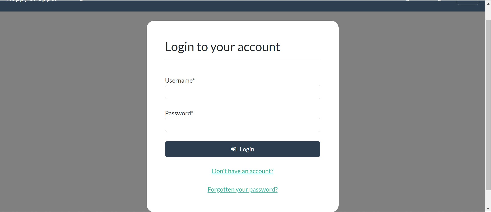

# Dashboard
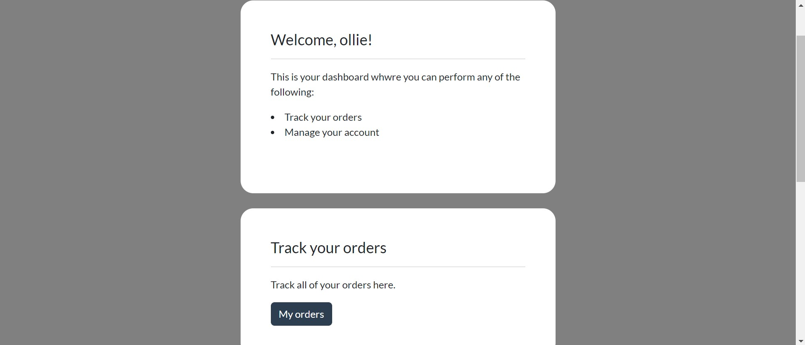

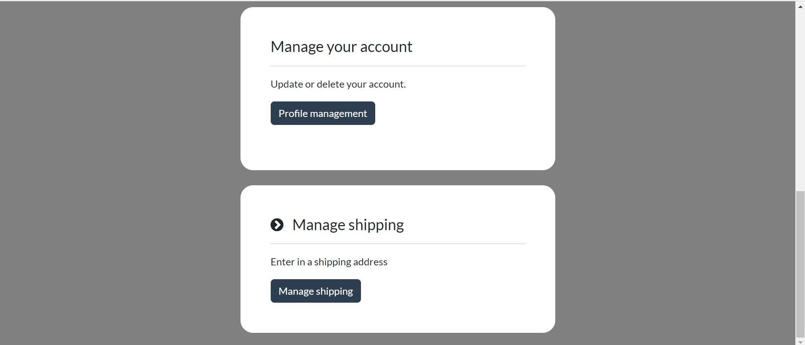

# Add to Cart
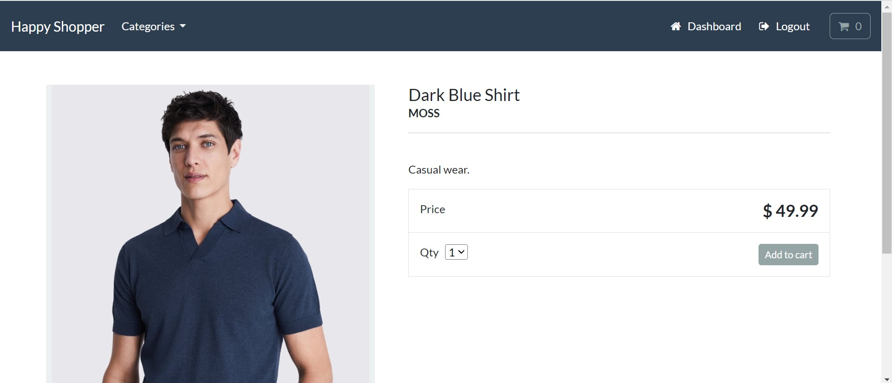

# Cart
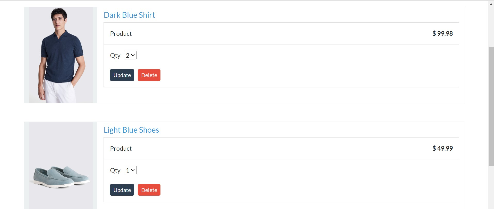

# Checkout
### If you're logged into your account then your shipping info will show up, if you're not then you'll need to manually put that info in. You can also pay by card or PayPal.
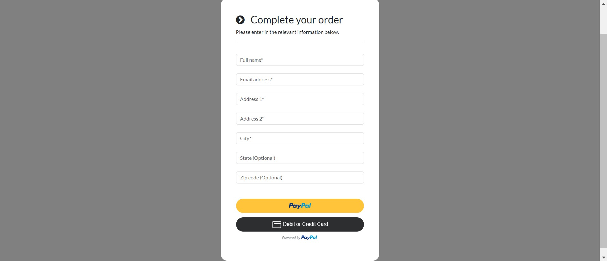

# PayPal Purchase
### I created two PayPal accounts, one for a customer and one to act as the merchant in order to recreate what an actual purchase would look like through PayPal.
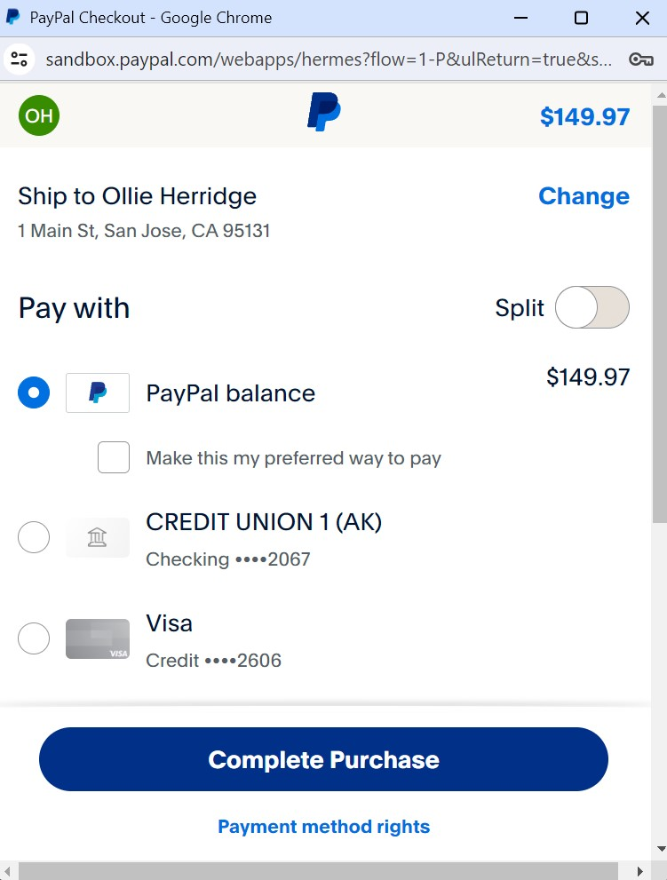

# Django Admin
### This image shows the different purchases that were made.
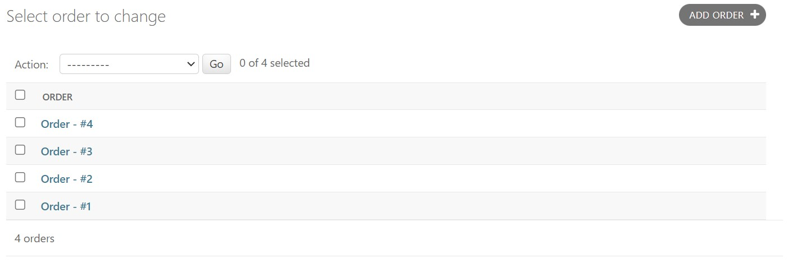

### This image shows the information captured when a purchase was made and whether that was a user or someone that was just visiting the site.

# Other Features
* Register an account 
* Categories - choose a clothing category ewith the drop down
* Forgotten password - change your password via email
* My Orders - track what you have orderd when logged into your account
* Manage Your Account - update your email or delete your account
* Manage Shipping - change your default shipping details

# Tools Used
* HTML
* CSS
* Django
* Python
* JavaScript
* AJAX
* JSON
* PayPal API
* Bootstrap
* Bootswatch
* Fontawesome

# Testing
* Used Shell terminal and Cookies in the Application tab in Developer Tools to check the carts functionality sessions and if a user had previously been on the site.
* Used Developer Tools to test the sites reactiveness 
* Used Django Admin to understand if data was being pushed through from the site such as; logins and purchases

Lighthouse Testing
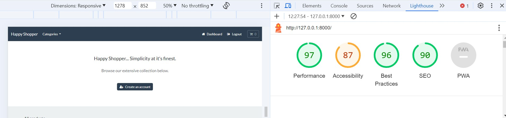
